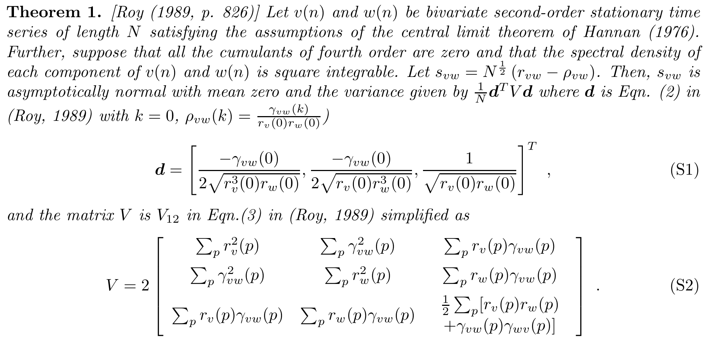

<!-- badges: start -->  

<!-- badges: end -->

# varSPCC
R package for estimating variance of sample Pearson correlation between two auto-correlated time series as detailed in James et al. [^1]. In particular, I provided the implementation of the variance following the Roy's theorem inidcated below [^2].

[^1]: **James, O,** Park, H, Kim, S-G. Impact of sampling rate on statistical significance for single subject fMRI connectivity analysis. **Human Brain Mapping**  2019; 40: 3321–3337. https://doi.org/10.1002/hbm.24600
[^2]:  Roy, R., 1989. Asymptotic covariance structure of serial correlations in multivariate time series.
Biometrika 76 (4), 824–827.

